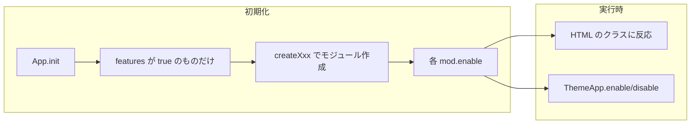
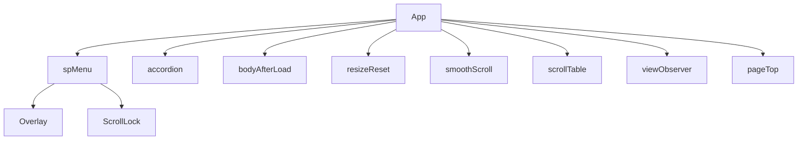

# テーマ共通 JS（common.js）構成・運用ルール

本テーマの共通スクリプト（common.js）は、**保守性・再利用性・属人化防止**を目的として設計されています。
非エンジニアや将来の担当者、AI アシスタントが迷わず安全に運用できるよう、以下のルールに従ってください。

---

## 要点まとめ（まずここだけ読めばOK）

このドキュメントは、**テーマ共通 JS（common.js）の設計・運用方針**の提案書です。

### 設計の前提

- **機能は 1 箇所で ON/OFF**：`App.features` で各機能の有効/無効を管理します。ここを変えるだけで、どの機能が動くかが決まります。
- **HTML のクラスで動く**：ボタンやメニューに `.js-menu-toggle` や `.js-accordion-btn` などのクラスを付けると、対応する機能が動きます。JS 側に「どの要素に効かせるか」をハードコードせず、クラス名で決めます。
- **各機能は enable/disable で個別 ON/OFF 可能**：初期化後も `ThemeApp.enable('名前')` / `disable('名前')` で制御できます（詳細は6章）。
- **共通の仕組みは key で共有**：背景固定（ScrollLock）と暗いシート（Overlay）は key で管理し、複数機能が同時利用しても競合しません。

### 機能一覧（必要な HTML）

| 機能名 | 役割 | 必要な HTML（クラス・要素） | たとえば |
| :--- | :--- | :--- | :--- |
| **spMenu** | スマホ用メニューの開閉 | `.js-menu-toggle`（ボタン）、`.js-menu`（メニュー本体） | ハンバーガーメニュー |
| **accordion** | 折りたたみの開閉 | `.js-accordion-btn`（ボタン）、直後の要素に `.js-accordion-content`（中身） | FAQ の開閉 |
| **bodyAfterLoad** | ロード完了で body のクラスを切り替え | `body` に初期で `is-loading` を付けておく | ローディング表示の解除 |
| **resizeReset** | PC 幅になったら SP メニューを閉じる | （spMenu が ON のとき有効） | メニュー開いたままリサイズしたときの保険 |
| **smoothScroll** | 同ページ内の # リンクをスムーズにスクロール | `a[href^="#"]`、固定ヘッダーがあれば `.js-header` | アンカーリンク・ページトップへ |
| **scrollTable** | 横スクロール表が画面に入ったらヒント表示 | `.c-table--scroll`（表のラッパー） | スマホの横スクロール表の「スクロールできます」演出 |
| **viewObserver** | 要素が画面に入ったらクラス付与 | `.js-view`（複数可） | スクロールで表示されるアニメーション用 |
| **pageTop** | ページトップへ戻るボタンの表示・クリック | `.js-pagetop`（ボタン要素） | 「トップへ」ボタン |

### 共通の仕組み（ScrollLock / Overlay）

| 仕組み | 役割 | いつ使うか |
| :--- | :--- | :--- |
| **ScrollLock** | 背景（ページ）のスクロールを止める | メニューやモーダルを開いたとき、背面が動かないようにする |
| **Overlay** | 画面の手前に暗いシートを表示する | body に `is-overlay-active` などを付け、CSS でオーバーレイを表示する |

どちらも「key」で管理するため、メニューとモーダルが同時に開いていても、最後に閉じるまで解除されません。

### 機能の切り替え

- **初期**：`App.features` の true/false で、読み込み時に有効にする機能を決める。
- **実行後**：`ThemeApp.disable('名前')` / `ThemeApp.enable('名前')` で個別に ON/OFF（詳細は[6章](#6-機能の-onoff-とオプション)）。

### AI に依頼するとき

- このドキュメントの設計思想（App.features で管理、HTML クラスで駆動、enable/disable の一貫、ScrollLock/Overlay は key 管理）に従うよう明示すると、ルールに沿ったコードが出やすくなります。

---

## 目次

1. [設計思想](#1-設計思想)
2. [機能一覧と必要な HTML](#2-機能一覧と必要な-html)
3. [モジュール構造と依存レベル](#3-モジュール構造と依存レベル)
4. [共通ユーティリティ（ScrollLock / Overlay）](#4-共通ユーティリティscrolllock--overlay)
5. [責務の境界と禁止事項](#5-責務の境界と禁止事項)
6. [機能の ON/OFF とオプション](#6-機能の-onoff-とオプション)
7. [命名規則](#7-命名規則)
8. [新しい機能を足すときの考え方](#8-新しい機能を足すときの考え方)
9. [AIアシスタントへの指示ルール](#9-aiアシスタントへの指示ルール)

---

## 1. 設計思想

### 全体の流れ

共通スクリプトは **App** が「入口」です。ページ読み込み完了（DOMContentLoaded）で `App.init()` が 1 回だけ実行され、**App.features で ON になっている機能だけ**がモジュールとして作られ、順番に「有効」になります。OFF の機能は作られません。



- **単一エントリ**：機能の追加・削除は App.features と App.init() 内の数行で完結します。どこに何があるかが分かりやすくなります。
- **HTML にクラスを付けると動く**：どのボタンやどのブロックに効かせるかは、HTML のクラス（`.js-menu-toggle` など）で決めます。JS 側にセレクタを直書きしないことで、デザイン変更やマークアップの変更に強くなり、「このクラスを付ければこの動きになる」と意図が伝わります。
- **各モジュールは enable/disable を持つ**：テストや部分無効化に使う。呼び方・注意点は[6章](#6-機能の-onoff-とオプション)・[8章](#8-新しい機能を足すときの考え方)を参照。

### その他の方針

- **依存ライブラリなし**：Vanilla JS で書いており、フレームワークは使いません。IntersectionObserver が使えない環境では、scroll イベントで代替するなど、必要最小限のフォールバックを持ちます。
- **アクセシビリティ**：SP メニューでは `aria-expanded` / `aria-controls` / `aria-hidden` を設定し、スクロールロックは解除時に元の位置に戻します。
- **グローバル公開**：`window.ThemeApp` / `window.ThemeOverlay` / `window.ThemeScrollLock` で、デバッグや外部からの制御ができるようにしています。

---

## 2. 機能一覧と必要な HTML

各機能は「このクラス（セレクタ）がある要素」に反応します。HTML に該当するクラスを付けるだけで動きます。依存関係は[3章](#3-モジュール構造と依存レベル)を参照。

| 機能名 | 役割（1行） | 必要な HTML | 備考 |
| :--- | :--- | :--- | :--- |
| **spMenu** | スマホ用メニューの開閉 | `.js-menu-toggle`（トグルボタン）、`.js-menu`（メニュー本体） | 開くと Overlay と ScrollLock を使用 |
| **accordion** | 折りたたみの開閉 | `.js-accordion-btn`、その直後の兄弟に `.js-accordion-content` | ボタンと中身はセットで 1 つ |
| **bodyAfterLoad** | ロード完了で body のクラスを is-loading → is-loaded に変更 | 初期の `body` に `is-loading` を付与 | ローディング表示の解除用 |
| **resizeReset** | 画面幅が PC 以上になったら SP メニューを閉じる | （spMenu が ON のとき有効） | body の `is-menu-open` も解除 |
| **smoothScroll** | 同ページ内の # リンクをスムーズスクロールし、必要なら URL の # を削除 | `a[href^="#"]`。固定ヘッダーは `.js-header` で高さ取得 | 外部・別ページは通常遷移 |
| **scrollTable** | 横スクロール表（.c-table--scroll）が画面に入ったら `.is-show` を付与 | `.c-table--scroll` | CSS でヒントアニメーション用 |
| **viewObserver** | 要素が画面に入ったら `.is-view` を付与（入ったら固定 or 出たら解除はオプション） | `.js-view`（複数可） | スクロールアニメ用。once で固定/解除を切替 |
| **pageTop** | スクロール量に応じて表示し、クリックでページ先頭へ | `.js-pagetop` | 表示閾値はオプションで変更可 |

※ 詳細なセレクタやクラス名は common.js 内の各 `createXxx` のオプションを参照してください。

---

## 3. モジュール構造と依存レベル

### モジュール関係図



### 依存レベル定義

本テーマでは、機能の責務と複雑性を明確にするため、依存レベルを定義します。

- **Level 1（単独機能）**  
  他モジュールに依存しない機能。例：accordion / pageTop / smoothScroll

- **Level 2（共通ユーティリティ依存）**  
  Overlay または ScrollLock を利用する機能。例：spMenu。※ resizeReset は spMenu に依存し、spMenu が ON のときのみ有効です。

- **Level 3（複合依存）**  
  複数の共通ユーティリティや他モジュールと連携する拡張機能（将来想定）

新機能を追加する際は、どの依存レベルに属するかを明示してください。

---

## 4. 共通ユーティリティ（ScrollLock / Overlay）

メニューやモーダルで「背景を止めたい」「暗いシートを出したい」場合に、**ScrollLock** と **Overlay** を key で共有して使います。body のクラス・スクロール制御はここ経由のみ（[5章](#5-責務の境界と禁止事項)禁止事項）。

### ScrollLock

- **役割**：body のスクロールを固定し、メニューやモーダルを開いている間、背面のページが動かないようにします。複数の機能が同時に lock しても、すべて unlock されるまで解除しません（key ごとにカウント）。
- **主な API**：`lock(key)` / `unlock(key)` / `reset()`。`ThemeScrollLock.locked` でロック中かどうか、`ThemeScrollLock.size` でロック数が分かります。
- **例**：spMenu は `ScrollLock.lock('spMenu')` で開き、`ScrollLock.unlock('spMenu')` で閉じるときに解除します。

### Overlay

- **役割**：body にクラス（`is-overlay-active` および `is-overlay--type`）を付け、CSS 側でオーバーレイ（暗い背景）を表示できるようにします。どの機能がオーバーレイを出しているかは key/type で管理します。
- **主な API**：`show({ key, type })` / `hide({ key })` / `reset()`。`ThemeOverlay.active` でオーバーレイ表示中かどうかが分かります。
- **例**：spMenu は `Overlay.show({ key: 'spMenu', type: 'menu' })` で表示、`Overlay.hide({ key: 'spMenu' })` で非表示にします。

| ユーティリティ | いつ使うか | 主な API |
| :--- | :--- | :--- |
| **ScrollLock** | メニュー・モーダルを開いたときに背景を固定したい | `lock(key)`, `unlock(key)`, `reset()` |
| **Overlay** | メニュー・モーダル背面に暗いシートを出したい | `show({ key, type })`, `hide({ key })`, `reset()` |

---

## 5. 責務の境界と禁止事項

### 責務の境界

- **App**
  - 機能の登録と初期化のみを担当する
  - 直接 DOM 操作をしない

- **createXxx モジュール**
  - 自身のセレクタ配下の DOM 操作のみ行う
  - enable / disable を必ず返す

- **Overlay / ScrollLock**
  - body クラス制御およびスクロール制御のみを担当する
  - 機能固有のロジックを持たない

### 禁止事項

1. createXxx の外で直接 DOM 操作を行わない
2. modules オブジェクトを外部から直接書き換えない
3. body.classList を直接操作しない（Overlay / ScrollLock を経由すること）
4. セレクタをモジュール外にハードコードしない
5. enable / disable を持たない機能を追加しない

---

## 6. 機能の ON/OFF とオプション

要点まとめの「機能の切り替え」の詳細です。

### 初期の ON/OFF（読み込み時）

- `App.features` を `true` / `false` にすると、その機能が初期化時に作られるかが決まります。`false` の機能はモジュールが作られず動きません（例：`accordion: false`）。

### 初期化後の個別 ON/OFF

- `ThemeApp.disable('機能名')` / `ThemeApp.enable('機能名')` で、実行後に一時的に OFF/ON にできます。有効になるのは**初期化時に作られたモジュールのみ**。`App.features` で `false` にしている機能には enable しても効きません。

### オプションの変更

- 各機能は `createXxx(userOptions)` の第 1 引数でオプションを渡せます。セレクタやクラス名、ブレークポイントなどを変えたい場合は、common.js の App.init() 内で `createXxx({ セレクタ名: '...' })` のように渡します。
- 詳細なオプション名と初期値は、common.js 内の各 `createXxx` の先頭にある `options` オブジェクトを参照してください。

---

## 7. 命名規則

### クラス命名

- `js-xxx` : JavaScript 制御用フック（見た目に依存しない）
- `is-xxx` : 状態クラス
- `c-xxx`  : コンポーネント

### 関数命名

- 機能生成関数は `createXxx`
- 内部メソッドは `open / close / toggle`
- 共通ユーティリティは PascalCase（Overlay / ScrollLock）

命名規則は設計の一貫性を守るために必ず従ってください。

---

## 8. 新しい機能を足すときの考え方

[5章](#5-責務の境界と禁止事項)（責務・禁止）と[7章](#7-命名規則)（命名）を満たしたうえで、以下で追加します。

1. **createXxx を定義する**  
   `createXxx(userOptions)` のように、デフォルトオプションと `userOptions` をマージし、少なくとも **enable** / **disable** を持つオブジェクトを返す関数を書きます。必要なら open / close / toggle も返します。

2. **App.features に追加する**  
   `App.features` に `xxx: true`（または初期は `false`）を追加します。

3. **App.init() に登録する**  
   `if (this.features.xxx) this.modules.xxx = createXxx();` を追加し、既存の `Object.values(this.modules).forEach((mod) => mod?.enable?.());` の流れに乗せます。これで、ON のときだけモジュールが作られ、有効化されます。

4. **ScrollLock / Overlay を使う場合**  
   メニューやモーダルのように「背景固定」「オーバーレイ」が必要な機能は、**key を 1 つ決めて**、開くときに lock/show、閉じるときに unlock/hide を対で呼びます。既存の spMenu と同じ key は使わず、別名（例：`modal`）にすると競合しません。

---

## 9. AIアシスタントへの指示ルール

AI（ChatGPT, Claude, GitHub Copilot など）に common.js の修正や機能追加を依頼するときは、以下の文章をコピーして一緒に渡すと、このプロジェクトの設計思想に沿ったコードが出力されやすくなります。

```markdown
# AIへの指示ルール（テーマ共通 JS / common.js）
このプロジェクトの common.js 設計ルールに従ってコーディングしてください。

## 重視する制約
1. **入口の一元管理**: 機能の ON/OFF は App.features で管理すること。新機能は App.features に追加し、App.init() 内で「features が true のときだけ createXxx() で modules に登録し、Object.values(this.modules).forEach((mod) => mod?.enable?.()) で有効化する」流れを崩さないこと。
2. **HTML 駆動**: どの要素に効かせるかは HTML のクラス（.js-xxx など）で決めること。セレクタは各 createXxx の options で定義し、ハードコードを散らさないこと。
3. **モジュールのインターフェース**: 各 createXxx は enable / disable を返すこと。必要に応じて open / close / toggle を返すこと。オプションはデフォルトと userOptions のマージにすること。
4. **ScrollLock / Overlay**: 背景固定やオーバーレイが必要な機能は、ScrollLock / Overlay を key で利用すること。lock と unlock、show と hide を対で呼び、key は他機能と重複しない名前にすること。
5. **依存関係**: フレームワークに依存せず Vanilla JS で書くこと。IntersectionObserver を使う場合は非対応環境用のフォールバック（scroll など）を考慮すること。
6. **アクセシビリティ**: メニューやモーダルの開閉では、aria-expanded / aria-controls / aria-hidden などを適切に更新すること。
7. **禁止事項**: createXxx の外での DOM 操作、modules の直接書き換え、body.classList の直書き（Overlay/ScrollLock 経由必須）、セレクタのモジュール外ハードコード、enable/disable を持たない機能の追加は行わないこと。
```
