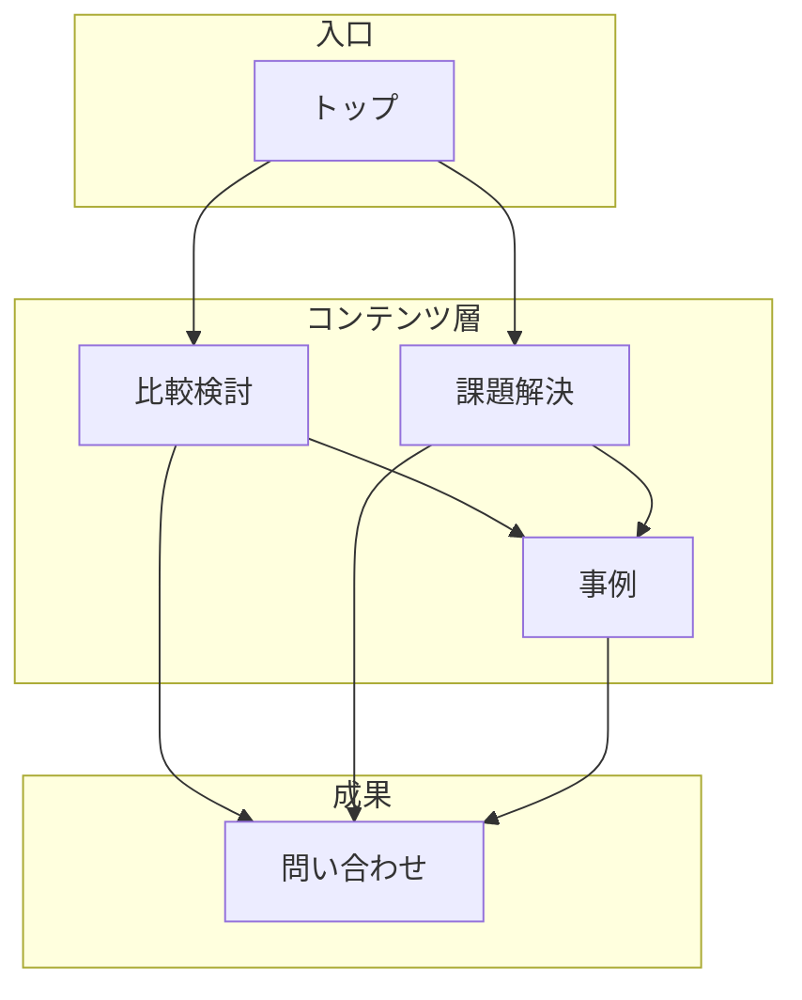

# SEO・AIO対策まとめ（kiomiru.co.jp）

## 目的
**最終目的：検索キーワード「Web制作会社」での露出を増やすこと**

---

## 全体整理（まず押さえたいこと）
現在のサイトは、内容やページ数そのものは十分にあります。  
また、**「Web制作会社 東京」では比較的上位を維持しており、キオモノ・キオマネなど他領域も上位にいるため、ドメイン全体のペナルティや重大な異常の可能性は低そう**です。

一方で、**「Web制作会社」というキーワードに対して、どのページを主力として評価してほしいのかが少し分散しており、検索エンジンに重要ページが伝わりにくい状態**と考えられます。

そのため、今後は以下の形に整理していくのが重要です。

※ トップ＝何が強い会社かを簡潔に伝える／比較検討＝Web制作会社の選び方・BtoBに強い など／課題解決＝問い合わせ獲得・採用強化・SEO改善 など／事例＝成果・業種・支援内容

### ポイント
- **トップページ**：要点を伝えるページ
- **比較検討ページ**："Web制作会社を探している人"向けのページ
- **課題解決ページ**：悩み別に詳しく説明するページ
- **事例ページ**：信頼性を高めるページ

つまり、**「トップで全部説明する」ではなく、役割ごとにページを整理すること**が重要です。

---

## 現サイトの評価（強み）
- サイト全体の作りはしっかりしており、ページ数も十分にある
- 「課題解決ページ」など、テーマごとの詳細ページはすでに存在している
- 実績、サービス、会社情報など、評価される材料はそろっている
- 「Web制作会社 東京」では比較的上位にいることから、関連テーマでの評価は残っている
- 「キオモノ」「キオマネ」など別領域も上位にいるため、ドメイン全体が弱くなっているわけではない
- Search Consoleでも大きな異常が出ておらず、**ペナルティの可能性は低い**と考えられる

---

## 現サイトの課題点
- 情報が広く存在している一方で、**「Web制作会社」でどのページを最重要として評価してほしいのかがやや分かりにくい**
- 「課題解決」には強いが、**「Web制作会社を比較して探している人」向けの受け皿は強化余地がある**
- トップページに役割が集まりやすく、重要ページへの評価が分散しやすい
- sitemap や URL ルールなど、技術面でも整理の余地がある
- AI未対応そのものが直接原因とは言い切れないが、**検索とAIの両方に伝わりやすい情報整理が不足していた可能性**はある

---

## 今後の対策方法

### 前提整理
- 今回の下落は、ドメイン全体のペナルティというより、**「Web制作会社」という単一キーワードでの相対評価低下**として見るのが自然
- そのため、まずは**情報整理とテクニカル確認を優先**し、そのうえでAIも意識した改善を進める
- AI対応は重要だが、まず先に「どのページを評価してほしいか」を明確にすることが優先

### 1. サイトの情報整理
- トップページは「何が強い会社か」を簡潔に伝える役割に絞る
- 詳細はテーマごとのページに分ける
- 「課題解決ページ」は活かしつつ、「比較検討ページ」を強化する
- 実績、サービス、比較検討ページを整理し、重要ページに評価が集まるようにする
- 「Web制作会社」を比較して探している人向けのページを明確に主力化する
- 「課題解決ページ」と「比較検討ページ」の役割の違いを整理する

### 2. 技術面の整理
- 検索エンジンに「どのページが重要か」を正しく伝える
- URL、sitemap、構造化データ、内部リンクを整える
- 不要ページや古いページを整理し、評価を集中させる
- 重大なエラー探しというより、相対評価を落とす小さな技術的ノイズを減らす
- sitemap、canonical、URL、内部リンクなどのズレを優先的に確認する

---

## コードベースで確認・改善したい項目
- sitemap.xml に載せるページを整理する
- 重複URLを削除する
- URL表記（末尾スラッシュあり/なし、.html有無）を統一する
- canonical と sitemap のURLを一致させる
- 更新日（lastmod）が古いままのページを見直す
- 不要ページや古いページを sitemap に載せ続けないよう整理する
- 本体サイト、採用、派生サービスなどを sitemap 上で整理・分割する
- パンくずの構造化データ（BreadcrumbList）を実装する
- 会社情報の構造化データ（Organization / LocalBusiness）を実装する
- サービス内容を伝える構造化データ（Service）を整理する
- FAQがあるページには FAQ構造化データを付ける
- title、h1、URL、パンくずの内容を揃える
- 重要ページ同士の内部リンクを整理して、「Web制作会社」に関係するページへ評価を集める
- 古いLPや使っていないページを残すか、統合するか、noindexにするかを棚卸しする
- sitemap を外部ツール任せではなく、更新内容に合わせて正しく出せる仕組みにする

---

## 特に優先度が高いもの

今回の件は、**「サイト全体が悪い」のではなく、「Web制作会社」で評価を集める設計が少し弱い**という見方が自然です。  
そのため、まずは情報整理と技術整理を優先し、その後にAIも含めた強化を進めるのがよいです。

### 優先度1：サイトの情報整理 **→ 重要ページの役割をはっきり分ける**
- トップは要点だけ
- 詳細はテーマ別に分ける
- 「Web制作会社」に関係する重要ページを明確にする

### 優先度2：sitemap / canonical / URLの整合性確認 **→ 検索エンジンに正しいURLを正しく伝える**
- 重複や表記ゆれをなくす
- 検索エンジンに正しいURLを伝える

### 優先度3：lastmod と掲載ページの見直し **→ 古い情報や不要ページを整理する**
- 古い更新日のままになっている重要ページを修正する
- 不要ページは sitemap から整理する

### 優先度4：構造化データの実装
- BreadcrumbList
- Organization / LocalBusiness
- Service
- FAQ

### 優先度5：内部リンクの整理
- 「Web制作会社」に関連する重要ページへサイト内評価を集めやすくする

---

## ひとことでまとめると
**今の課題は、サイト全体が弱いことではなく、「Web制作会社」で評価を集めるページ設計が少し分散していることです。**

そのため、まずは
**サイトの情報整理を行ったうえで、sitemap・URL・構造化データ・内部リンクを整え、検索エンジンに「どのページを評価してほしいか」を明確に伝えること**
を優先し、その次の段階でAIも意識した比較検討コンテンツやFAQ・事例整理を強化していく、という順番がよいです。
